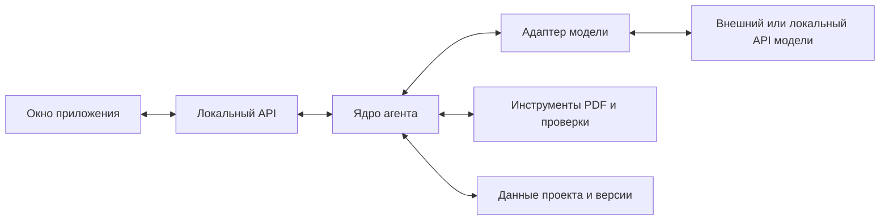

# План проектирования приложения ИИ СКАНЕР

10 октября 2026 года. План определяет устройство первой версии приложения и последовательность подготовки к разработке. Рабочая основа: отдельное настольное приложение, Python, FastAPI, React с TypeScript и Tauri; модель подключается через API с возможностью собственного развёртывания. Первый кандидат для испытаний — Kimi K3; окончательный выбор зависит от качества на наших чертежах.

## Результат первой версии

Пользователь открывает PDF-чертёж, запускает разбор и получает описание детали: общие сведения, все распознанные поверхности, размеры, связи и технические требования. Каждое существенное значение можно проверить по исходному чертежу, исправить и повторно проверить. Приложение экспортирует JSON по согласованной JSON Schema для следующего агента построения 3D-модели.

Требование описывать все поверхности сохраняется. Область первой версии нужно ограничить согласованными типами деталей и обозначений, чтобы полноту можно было проверить. Пропущенная или неоднозначная поверхность означает неполный результат. Отдельно оценивается полнота технических требований: определённая номинальная форма не означает, что все требования расшифрованы.

Первую версию проектируем для Windows и работы одного пользователя. Она включает просмотр PDF, подключение модели, инструменты разбора, проверку и исправление данных, историю результатов и экспорт. Собственно построение CAD-модели, обучение моделей, совместная работа и управление установкой весов относятся к следующим этапам. Локальный режим первой версии подключается к уже запущенному совместимому API-серверу модели.

## Основной сценарий

1. Создать проект и загрузить PDF. Приложение сохраняет исходник и показывает листы.
2. Выбрать профиль модели и проверить подключение, изображения, инструменты и структурированный ответ.
3. Запустить разбор с видимыми ограничениями времени и числа обращений к модели.
4. Наблюдать этап обработки: подготовка листов, чтение общих сведений, разбор видов, определение поверхностей, привязка требований, проверка.
5. Открыть сомнительное значение или вопрос. Приложение показывает соответствующий фрагмент чертежа и связанные объекты.
6. Исправить данные или уточнить область для повторного чтения. Результат повторного чтения показывается как предлагаемое изменение.
7. Проверить выбранную версию и экспортировать JSON с её статусами готовности. Сохранить проект для продолжения работы.

## Экраны и рабочее пространство

| Экран или область | Что проектируем |
| --- | --- |
| Проекты | Создание, открытие, список последних проектов, источник PDF, дата и состояние последней проверки. |
| Основное рабочее окно | Слева страницы и PDF с масштабированием; справа общие данные и дерево поверхностей. Размеры панелей регулируются. |
| Карточка поверхности | Геометрия и границы, связанные размеры и элементы, местные требования, применимые общие требования, источники и нерешённые вопросы. |
| Общие сведения | Отдельная карточка `drawing_general`: материал, единицы, общие допуски, шероховатость, примечания и области их действия. |
| Проверка результата | Ошибки структуры, недостающие данные, противоречия, неподдержанные обозначения. Переход из сообщения к полю и к PDF. |
| Модель и инструменты | Адрес API, имя модели, ключ, возможности сервера, лимиты запуска, доступные инструменты и результат проверки подключения. |
| История и экспорт | Версии результата, изменения пользователя, сравнение версий, отчёт проверки и экспорт JSON. |

Внизу рабочего окна располагается сворачиваемый журнал действий: какой инструмент вызван, какую область он обработал, что вернул и сколько занял времени. Основные действия — «Начать разбор», «Остановить», «Перечитать область», «Проверить», «Экспортировать».

При выборе значения подсвечивается его источник на PDF. Обратный выбор области показывает связанные с ней данные. Для надёжной подсветки необходимо заранее определить преобразования координат страницы, изображения и экранного просмотра с учётом поворота и обрезки PDF.

Для макетов нужны состояния пустого проекта, загрузки, активного разбора, частичного результата, ошибки API, остановленного запуска и готового экспорта. Поле без данных должно объяснять причину: не задано, не прочитано, неоднозначно или ещё не проверено.

## Устройство приложения

| Часть | Ответственность и граница |
| --- | --- |
| React и TypeScript | Просмотр, формы, выделения, журнал и действия пользователя. Правила интерпретации чертежа находятся в ядре. |
| Tauri | Настольное окно, выбор файлов, запуск и завершение вспомогательного Python-процесса. |
| FastAPI | Команды интерфейса, получение данных и передача событий о ходе разбора. Длительная работа получает идентификатор запуска; интерфейс остаётся доступным. |
| Ядро на Python | Этапы разбора, рабочее состояние, вызовы модели и инструментов, сохранение версий и проверки. |
| Адаптеры моделей | Различия API, форматы изображений и вызовов инструментов, обработка ошибок и учёт использования. |
| Реестр инструментов | Именованные операции с описанными входами и результатами. Подключение нового инструмента не требует переписывать весь процесс разбора. |
| Хранилище | Исходники, результаты, источники, версии, запуски и изменения пользователя. |

FastAPI подходит для отдельной границы API ядра; Tauri документирует упаковку внешнего исполняемого процесса, в том числе Python API-сервера. Упаковку этой связки проверяем в начале разработки на Windows. [FastAPI](https://fastapi.tiangolo.com/), [вспомогательные процессы Tauri](https://v2.tauri.app/develop/sidecar/).

Настольная оболочка запускает ядро скрыто, ожидает его готовности и завершает при закрытии приложения после сохранения состояния. Локальный API слушает только интерфейс компьютера `127.0.0.1`; доступ ограничивается токеном текущего сеанса. Ключ поставщика модели получает ядро через хранилище учётных данных ОС. Он не включается в проект, экспорт и журнал.

Внешний и локальный режимы отличаются профилем подключения модели. В интерфейсе всегда виден адрес назначения. В локальном режиме нет автоматического перехода на внешний API при ошибке сервера. Версии библиотек фиксируем после проверки совместимости PDF, OCR, интерфейса и упаковки.

## Ядро и подключение инструментов

Ядро управляет последовательностью обработки: получает обзор документа, выделяет виды и общие сведения, уточняет фрагменты, собирает поверхности и связи, привязывает требования и проверяет результат. Модель предлагает интерпретации и запросы инструментов. Ядро проверяет аргументы, выполняет разрешённые операции и сохраняет результат каждого завершённого шага.

Первый набор инструментов: сведения о PDF, отрисовка страницы, получение фрагмента, извлечение встроенного текста и векторных элементов, OCR области, проверка JSON Schema и смысловых связей. Конкретные библиотеки PDF и OCR выбираем по качеству на примерах и пригодности для поставки в составе приложения. MCP предусматриваем как последующий способ подключения внешних инструментов к тому же реестру.

Для каждого инструмента задаём имя и версию, схему аргументов и результата, допустимые файлы проекта, тайм-аут, ограничения объёма и типы ошибок. Текст чертежа рассматривается как анализируемые данные и не может менять разрешения инструментов. Произвольное выполнение кода модели не входит в первую версию.

Профиль модели содержит адрес, точный идентификатор, ссылку на ключ, поддерживаемые возможности и лимиты. Проверка профиля выполняет небольшие тесты текста, изображения, инструмента и структурированного результата. Поддержка строгой генерации по схеме учитывается отдельно от способности вернуть JSON с последующей локальной проверкой. После смены модели сохраняется тот же контракт результата, но качество требуется оценить заново.

Для каждого запуска сохраняем модель и её настройки, версии схемы, инструментов и инструкций, разрешение изображений, время и сведения об использовании API. Стоимость показываем только при наличии подтверждённого тарифа и достаточных данных об использовании.

## Данные и версии

Состав выходных данных развивается из [контракта поверхностей](surface-data-contract.md). На этапе проектирования создаём исполняемую JSON Schema, полностью заполненный пример простой детали и несколько неполных или противоречивых примеров. Они становятся общей основой для интерфейса, ядра и следующего агента.

В JSON сохраняем `drawing_general` отдельно от `surfaces`. Геометрия, границы, размеры, топология и требования связаны устойчивыми идентификаторами. Общие требования хранятся один раз, а карточка поверхности показывает результат определения их применимости. IT относится к соответствующему размеру или элементу; шероховатость и другие требования сохраняют свой действительный объект и источник.

Для локального проекта предлагаем SQLite для записей и связей, а файлы PDF, изображений и снимков результата — в каталоге проекта. SQLite предназначен в том числе для локального хранения данных настольных приложений. Сетевое совместное редактирование в такую организацию не закладывается. [Области применения SQLite](https://sqlite.org/whentouse.html).

| Сущность | Что сохраняем |
| --- | --- |
| Проект и документ | Название, исходный PDF, контрольную сумму, страницы, параметры импорта и версию формата проекта. |
| Запуск | Состояние, конфигурацию, завершённые шаги, ошибки, обращения к модели и инструментам. |
| Версия результата | Полный снимок JSON, родительскую версию, автора изменения и отчёт проверки именно этой версии. |
| Источник | Документ, страницу, область, систему координат, исходный текст или фрагмент и связи с извлечёнными значениями. |
| Исправление пользователя | Старое и новое значение, причину при наличии, источник, автора и время. |

Рабочие данные находятся в пользовательском каталоге приложения, отдельно от исходного кода и Git. В репозиторий попадают код, схемы, инструкции и разрешённые обезличенные примеры. Экспортируемый JSON не зависит от SQLite или внутренних путей компьютера: ссылки на источник используют идентификатор документа, страницу и координаты. При передаче следующему агенту исходный PDF можно приложить вместе с JSON.

Ручное исправление создаёт новую версию. Повторный разбор не перезаписывает её: он формирует изменения для сопоставления. Любая правка делает предыдущий отчёт проверки неактуальным для новой версии. При объединении или разделении поверхностей обновляются ссылки и сохраняется соответствие старых и новых идентификаторов либо явно отмечается неоднозначность.

## Состояния запуска и восстановление

Основная цепочка состояний: создан → подготовка → разбор → проверка → завершён. Из активных состояний возможны остановка, ошибка или ожидание уточнения. Завершение обработки отделено от готовности результата: запуск может закончиться с неполными данными.

После каждого завершённого этапа ядро сохраняет контрольную точку. После перезапуска пользователь может продолжить с неё; незавершённый запрос к модели может потребовать повторения. Повторы сетевых запросов ограничены, учитывают уже сохранённый результат и показывают возможное дополнительное использование API. Автоматическое бесконечное исправление JSON исключается лимитом попыток.

Команда «Остановить» прекращает новые вызовы и сохраняет завершённую работу. Ответ уже отправленного запроса не должен менять остановленную версию результата. Если внешний сервер не поддерживает отмену вычисления, интерфейс сообщает об этом. При аварийном завершении активный запуск помечается прерванным, а его сохранённые версии остаются доступны.

## Проверки и передача следующему агенту

| Уровень | Условие успешной проверки |
| --- | --- |
| Структура | JSON соответствует выбранной версии схемы; неизвестное значение не подменено нулём. |
| Связи | Идентификаторы уникальны; все ссылки существуют; требования связаны с подходящими объектами. |
| Источники | Существенные прочитанные значения имеют ссылки на PDF, а вычисленные — исходные данные и основание расчёта. |
| Геометрия | Для поддерживаемых типов проверены параметры, размеры, границы, ориентация и связи поверхностей; найденные пробелы и противоречия отражены в результате. |
| Требования | Учтены местные и общие указания, их области действия и исключения; нерешённые конфликты явно отмечены. |
| Передача | Экспорт привязан к проверенной версии; версии схемы и статусы готовности доступны следующему агенту. |

Проверки первого агента не равны проверке построенного CAD-тела. В отчёте нужно различать выполненные проверки описания и проверки, требующие фактического построения. Агент построения не должен принимать отметку «не проверено» за успешную проверку.

Предусматриваем экспорт черновика с вопросами и экспорт результата для передачи. Черновик остаётся допустимым по схеме и содержит явные статусы неполноты. Для передачи без блокирующих замечаний нужны актуальная проверка и разрешённые вопросы в согласованной области поддержки. До начала интеграции второй агент должен получить примеры обоих состояний и правила их обработки.

## Этапы проектирования

| Этап | Работа | Результат и критерий завершения |
| --- | --- | --- |
| 1. Границы первой версии | Выбрать типы деталей, сложность чертежей, обозначения, детализацию резьб и 3–5 характерных PDF. | Матрица поддержки и ручной перечень ожидаемых поверхностей и требований хотя бы для одного простого чертежа. Понятно, что считать полным результатом. |
| 2. Контракт данных | Уточнить поля, идентификаторы, источники, неизвестные значения, общие требования и готовность; выбрать версию JSON Schema. | Исполняемая схема, эталонный JSON простой детали, примеры неполноты и конфликтов. Проверка принимает корректные примеры и объясняет ошибки остальных. |
| 3. Проверка технической основы | Собрать минимальные прототипы: PDF → фрагмент → API модели → данные по схеме; отдельно проверить запуск Python из настольного окна. | Из реального PDF получены несколько значений с правильными источниками; собранное приложение запускает ядро на Windows без среды разработки. Зафиксированы ограничения API и упаковки. |
| 4. Проектирование интерфейса | Сделать связанные макеты основных экранов и состояний, включая исправление и повторное чтение. | По макетам можно пройти полный сценарий, найти источник значения, разобраться с ошибкой и подготовить экспорт. |
| 5. Внутренние контракты | Описать модули, команды API, события, протокол инструментов, состояния запусков, хранение и версии. | Согласованы сообщения интерфейса и ядра, примеры ошибок, порядок остановки и восстановления; определены проверки на каждой границе. |
| 6. План реализации и приёмки | Разделить работу на небольшие задачи с зависимостями; подготовить набор проверки и условия выпуска. | У каждой задачи есть наблюдаемый результат. Первый выпуск имеет ограниченную область поддержки и измеримые критерии, основанные на эталонных чертежах. |

Этапы 1–3 определяют осуществимость и контракт; после них уточняем оценку трудоёмкости. Прототип на этапе 3 подтверждает работу связки, но не полноту распознавания детали. Полный разбор всех поверхностей проверяется отдельно на эталонном наборе.

## Порядок реализации после проектирования

1. Каркас приложения: настольное окно, запуск ядра, создание и повторное открытие проекта, импорт и просмотр PDF.
2. Первый проход через всю систему: профиль API, страница и фрагмент, ответ модели, сохранение источников, проверяемый черновой JSON.
3. Разбор согласованного простого типа детали: общая информация, все поверхности, размеры, связи и требования.
4. Рабочая проверка: подсветка источников, вопросы, исправления, сопоставление повторного чтения и экспорт конкретной версии.
5. Устойчивость: ограничения запросов, ошибки сети, остановка, сохранение и восстановление, история и упаковка.
6. Расширение на согласованные случаи и испытание альтернативных моделей через тот же интерфейс API.

Структуру исходников разделяем по этим границам: `src/desktop` для оболочки, `src/ui` для интерфейса, `src/backend` для API, ядра, моделей, инструментов и хранилища, `schemas` для контрактов, `tests` для проверок и `docs` для проектных решений. Эти каталоги создаём по мере реализации.

## Приёмка первой версии

Набор из 10–20 размеченных чертежей должен включать согласованные типы деталей, векторные PDF и сканы, повёрнутые листы, несколько видов и разрезов, внутренние поверхности, общие требования с исключениями и заведомо недостаточные данные. Часть примеров сохраняем для итоговой проверки и не используем для настройки инструкций модели. Результаты фиксируем по типам чертежей, чтобы общий показатель не скрывал ошибки отдельных случаев.

Измеряем долю найденных поверхностей, лишние поверхности, точность чисел и единиц, привязку требований, корректность источников, обнаружение недостаточности, успешность инструментов, длительность и использование API. Порог приемлемого качества устанавливаем после ручной разметки и первого прогона; одного показателя валидности JSON недостаточно.

Обязательные условия выпуска: успешный экспорт проходит структурные и ссылочные проверки; каждый выявленный блокирующий вопрос отражается в готовности; проверка координат на повёрнутых и обрезанных листах проходит; исправления сохраняются после перезапуска; остановленный запуск не меняет принятую версию; API-ключ отсутствует в экспорте и журналах; локальный режим работает без скрытого обращения к внешнему поставщику. Установленная сборка проходит основной сценарий на Windows без VS Code и отдельно установленного Python.

Автоматические проверки нужны для схемы, преобразований координат, применения общих требований, версий, остановки и адаптеров API. Качество чтения оценивается сравнением с ручной разметкой, а удобство работы — прохождением пользовательского сценария.

## Что необходимо определить перед реализацией

Для первого этапа нужны примеры PDF и выбор первого класса деталей. Затем определяем уровень детализации резьб и условных обозначений, правила работы с неясными стандартами, профиль доступного API и лимиты испытаний. Контракт следующего агента нужно согласовать до замораживания схемы; конкретный CAD-инструмент понадобится перед интеграцией построения. Оборудование для локального сервера выбираем после сравнения моделей.

Ближайший результат проектирования — описание первой поддерживаемой детали, вручную проверенный пример её JSON и макет рабочего экрана. Они зададут проверяемую основу для разработки ядра и приложения.
